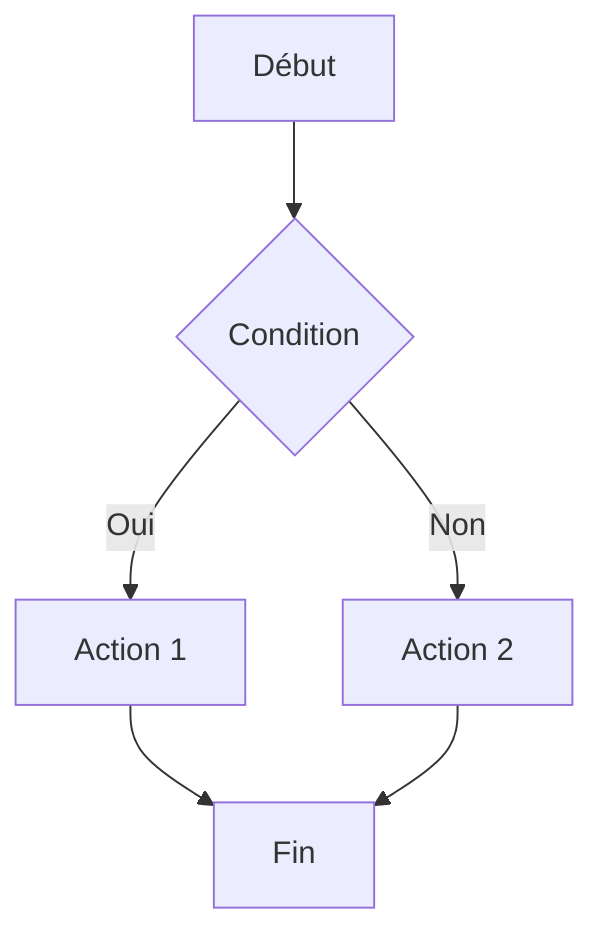
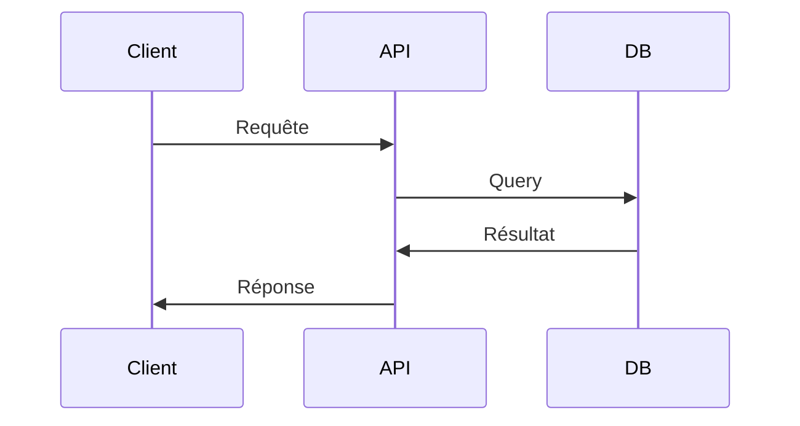
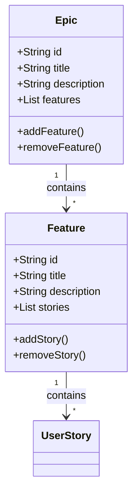
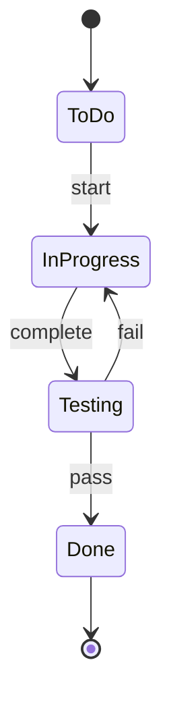
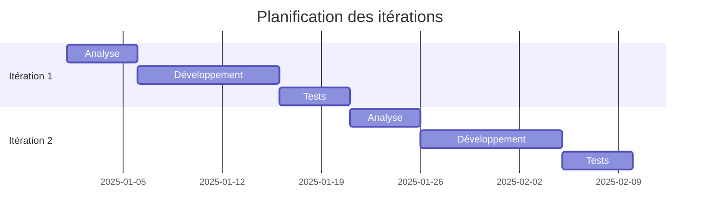
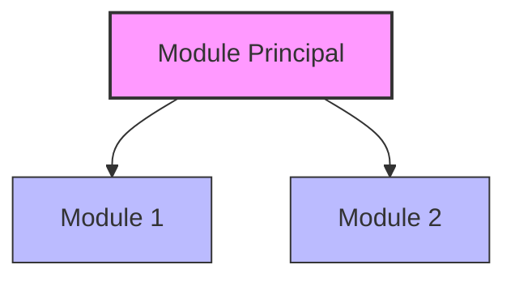

# Workflow de Documentation avec Mermaid - Agile Planner

## Description
Ce workflow guide le développeur dans la création et la maintenance de diagrammes Mermaid pour documenter l'architecture, les flux de données et les processus du projet Agile Planner. Les diagrammes Mermaid permettent de créer des visualisations claires directement dans les fichiers markdown, facilitant ainsi la compréhension du code et de l'architecture pour tous les membres de l'équipe. Ce workflow assure que les diagrammes sont cohérents, à jour et suivent les meilleures pratiques.

## Utilisation dans Wave 8
Dans Wave 8, ce workflow peut être déclenché manuellement lors de la création ou mise à jour de documentation technique, ou automatiquement lorsque des changements significatifs sont apportés à l'architecture du projet. Windsurf vous guidera à travers les bonnes pratiques et vous aidera à générer des diagrammes Mermaid optimaux.

## Déclencheur
- Lors de la création d'un nouveau module ou composant
- Lors de modifications significatives de l'architecture
- Lors de la mise à jour de la documentation technique
- Avant une release majeure

## Types de diagrammes à utiliser

### 1. Diagramme de flux (Flowchart)
Utiliser pour visualiser les processus et les flux de travail.



### 2. Diagramme de séquence (Sequence Diagram)
Utiliser pour illustrer les interactions entre composants.



### 3. Diagramme de classe (Class Diagram)
Utiliser pour documenter la structure des classes et leurs relations.



### 4. Diagramme d'état (State Diagram)
Utiliser pour illustrer les transitions d'état dans le système.



### 5. Diagramme de Gantt
Utiliser pour la planification des itérations et des releases.



## Étapes

### 1. Identifier le besoin de documentation
- Déterminer quel aspect du système nécessite une visualisation
- Choisir le type de diagramme le plus approprié
- Identifier l'audience cible (développeurs, stakeholders, etc.)

### 2. Créer le diagramme Mermaid
1. **Créer un brouillon du diagramme**
   - Utiliser l'[éditeur en ligne Mermaid](https://mermaid.live/) pour le prototypage
   - Tester différentes approches pour trouver la plus claire

2. **Intégrer le diagramme dans la documentation**
   - Ajouter le code Mermaid dans un fichier markdown
   ```markdown
   ## Architecture du système
   
   ```mermaid
   // Code du diagramme ici
   ```
   ```

3. **Ajouter des explications contextuelles**
   - Expliquer l'objectif du diagramme
   - Décrire les éléments clés et leurs interactions
   - Lier le diagramme au code source correspondant

### 3. Valider le diagramme
- S'assurer que le diagramme est techniquement correct
- Vérifier qu'il est compréhensible par l'audience cible
- Confirmer qu'il respecte les conventions de notation

### 4. Maintenir les diagrammes
- Mettre à jour les diagrammes lors de changements dans le code
- Vérifier régulièrement que les diagrammes sont toujours pertinents
- Supprimer ou archiver les diagrammes obsolètes

## Bonnes pratiques

### Structure et clarté
- Limiter chaque diagramme à une seule préoccupation ou concept
- Utiliser des noms clairs et descriptifs pour les nœuds
- Limiter le nombre d'éléments à 7±2 par diagramme pour faciliter la compréhension
- Organiser les éléments de manière logique (de gauche à droite ou de haut en bas)

### Style et formatage
- Utiliser la coloration pour distinguer différents types d'éléments
- Ajouter des commentaires dans le code Mermaid pour faciliter la maintenance
- Maintenir une convention de style cohérente entre tous les diagrammes
- Utiliser des liens pour connecter des diagrammes entre eux



### Emplacement des diagrammes
- Placer les diagrammes d'architecture générale dans `docs/architecture.md`
- Placer les diagrammes spécifiques à un module dans `docs/modules/[module-name].md`
- Inclure des diagrammes de flux dans les READMEs des dossiers concernés

## Validation
- Le diagramme est techniquement correct et à jour
- Le diagramme est clair et facilement compréhensible
- Le code Mermaid est bien formaté et commenté
- Le diagramme est placé au bon endroit dans la documentation

## Outils MCP à utiliser
- `sequential-thinking` pour planifier la structure des diagrammes complexes
- `context7` pour vérifier les meilleures pratiques de documentation avec Mermaid
- `brave-search` pour :
  - Explorer les dernières fonctionnalités de Mermaid (version 2025)
  - Rechercher des exemples de diagrammes similaires
  - Identifier les patterns de visualisation les plus efficaces pour le type de données à représenter
