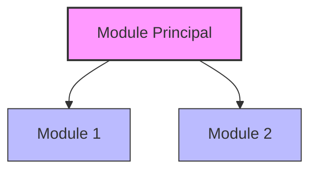

# Workflow de Documentation avec Mermaid – Agile Planner

## Description  
Ce workflow guide le développeur dans la création et la maintenance de diagrammes Mermaid pour documenter l’architecture, les flux de données et les processus du projet Agile Planner. Les diagrammes Mermaid intégrés aux fichiers Markdown offrent des visualisations claires, cohérentes et faciles à maintenir.

## Contexte Wave 8  
En Wave 8, ce workflow peut être déclenché :  
- Manuellement : lors de la création ou de la mise à jour de la documentation technique.  
- Automatiquement : après tout changement majeur de l’architecture.  

Windsurf vous oriente vers les meilleures pratiques et génère des diagrammes optimaux.

---

## Déclencheurs  
- Nouveau module ou composant  
- Modification significative de l’architecture  
- Mise à jour de la documentation technique  
- Avant une release majeure  

---

## Types de diagrammes

1. **Flux (Flowchart)**  
   Visualise les processus et décisions.  
   ```mermaid
   flowchart TD
     A[Début] --> B{Condition}
     B -->|Oui| C[Action 1]
     B -->|Non| D[Action 2]
     C --> E[Fin]
     D --> E
   ```

2. **Séquence**  
   Illustrer les échanges entre composants.  
   ```mermaid
   sequenceDiagram
     participant Client
     participant API
     participant DB
     Client->>API: Requête
     API->>DB: Query
     DB->>API: Résultat
     API->>Client: Réponse
   ```

3. **Classe**  
   Documenter les structures et relations.  
   ```mermaid
   classDiagram
     class Epic {
       +String id
       +String title
       +String description
       +List<Feature> features
       +addFeature()
       +removeFeature()
     }
     class Feature {
       +String id
       +String title
       +String description
       +List<UserStory> stories
       +addStory()
       +removeStory()
     }
     Epic "1" --> "*" Feature
     Feature "1" --> "*" UserStory
   ```

4. **État**  
   Montrer les transitions d’état.  
   ```mermaid
   stateDiagram-v2
     [*] --> ToDo
     ToDo --> InProgress: start
     InProgress --> Testing: complete
     Testing --> Done: pass
     Testing --> InProgress: fail
     Done --> [*]
   ```

5. **Gantt**  
   Planifier itérations et releases.  
   ```mermaid
   gantt
     title Planification des itérations
     dateFormat YYYY-MM-DD
     section Itération 1
     Analyse       :a1, 2025-01-01, 5d
     Développement :a2, after a1, 10d
     Tests         :a3, after a2, 5d
     section Itération 2
     Analyse       :b1, after a3, 5d
     Développement :b2, after b1, 10d
     Tests         :b3, after b2, 5d
   ```

---

## Processus

### 1. Identification  
- Définir l’objet de la visualisation  
- Choisir le type de diagramme  
- Cibler l’audience (développeurs, stakeholders…)

### 2. Création  
1. **Brouillon**  
   - Prototyper sur [mermaid.live](https://mermaid.live/)  
2. **Intégration**  
   ```markdown
   ## Architecture du système
   ```mermaid
   // code ici
   ```
   ```  
3. **Contexte**  
   - Objectif et portée  
   - Description des éléments clés  
   - Référence au code source  

### 3. Validation  
- Exactitude technique  
- Lisibilité pour l’audience  
- Conformité aux notations  

### 4. Maintenance  
- Mettre à jour suite aux modifications du code  
- Vérifier périodiquement la pertinence  
- Archiver ou supprimer les diagrammes obsolètes  

---

## Bonnes pratiques

### Structure & clarté  
- Un concept par diagramme  
- Noms explicites (nœuds, états…)  
- Limiter à ~7±2 éléments  
- Organisation logique (gauche→droite, haut→bas)

### Style & formatage  
- Couleurs pour distinguer les types d’éléments  
- Commentaires dans le code Mermaid  
- Convention uniforme pour tous les diagrammes  
- Liens cliquables pour naviguer d’un diagramme à l’autre  



### Emplacement  
- Diagrammes d’architecture : `docs/architecture.md`  
- Diagrammes par module : `docs/modules/[nom-module].md`  
- Flux dans les README des dossiers  

---

## Outils MCP recommandés  
- `sequential-thinking` pour la structure des diagrammes complexes  
- `context7` pour vérifier les best practices  
- `brave-search` pour :
  - Explorer les fonctionnalités Mermaid 2025  
  - Rechercher des exemples  
  - Identifier les patterns de visualisation efficaces  

---

## Critères de réussite  
- Diagramme à jour, exact et clair  
- Code Mermaid bien formaté et commenté  
- Placement approprié dans la documentation  
