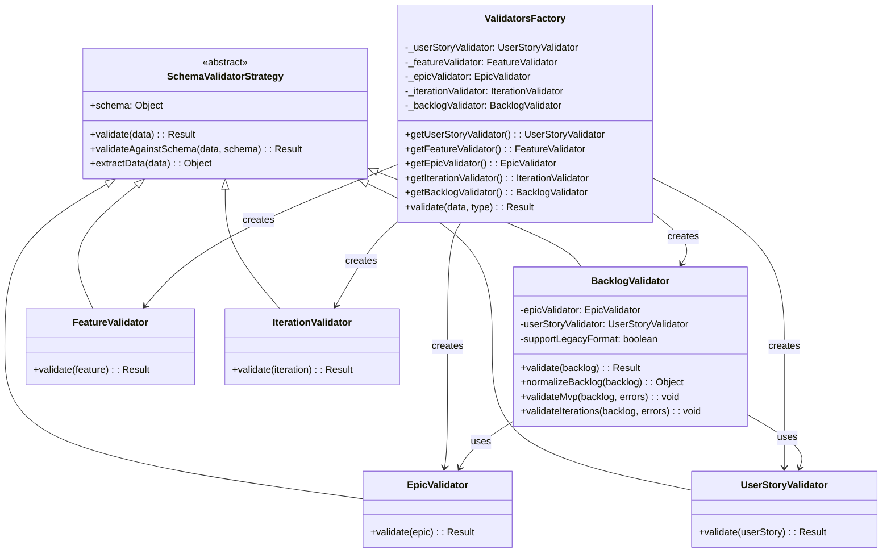
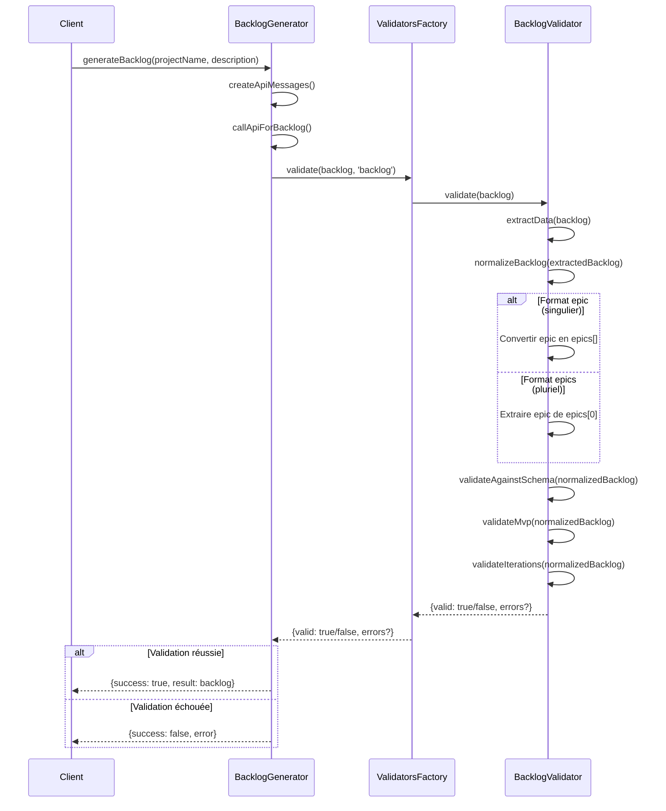

# Diagrammes d'architecture de validation du Backlog

Ce document présente les diagrammes Mermaid illustrant l'architecture et les flux de la validation du backlog, conformément à la RULE 7 (Documentation visuelle avec Mermaid).

*Dernière mise à jour: 08/05/2025*

## Diagramme 1: Normalisation des formats de Backlog

```mermaid
flowchart TD
    A[Backlog d'entrée] --> B{Détection format}
    B -->|Format "epic"| C[Normalisation vers format "epics"]
    B -->|Format "epics"| D[Normalisation vers format "epic"]
    B -->|Les deux formats présents| E[Backlog déjà normalisé]
    
    C --> F[Backlog normalisé]
    D --> F
    E --> F
    
    F --> G[Validation avec schema]
    G --> H{Validation réussie?}
    
    H -->|Oui| I[Résultat: valid=true]
    H -->|Non| J[Résultat: valid=false, errors=[...]]
```

## Diagramme 2: Architecture des Validateurs (Pattern Strategy)



## Diagramme 3: Processus de validation du Backlog



Ces diagrammes respectent les principes de la RULE 7 :
- Maximum 7±2 éléments par diagramme
- Un seul concept clair par diagramme
- Noms explicites et organisation logique
