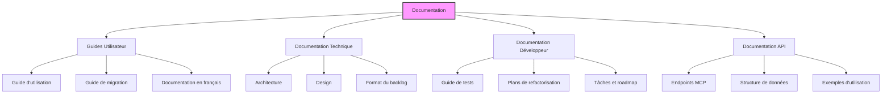

# Documentation Agile Planner MCP Server

## Structure de la Documentation

Cette documentation a été réorganisée selon les règles Wave 8 pour une meilleure navigation et maintenance.

## Catégories principales

| Section | Description | Contenu |
|---------|-------------|---------|
| [📚 Guides](./guides/) | Documentation utilisateur | Guides d'utilisation, migration, etc. |
| [🏗️ Architecture](./architecture/) | Documentation technique | Design, structure, diagrammes |
| [💻 Développement](./development/) | Documentation développeur | Tests, refactorisation, tâches |
| [🔌 API](./api/) | Documentation API | Endpoints, schémas, exemples |

## Principes de documentation

Cette documentation suit les principes Wave 8, notamment :

1. **Documentation visuelle avec Mermaid** (RULE 7)
   - Diagrammes clairs avec un maximum de 7±2 éléments par diagramme
   - Visualisation des flux, séquences, classes, états et processus

2. **Structure cohérente** (RULE 3)
   - Hiérarchie claire avec une navigation intuitive
   - Séparation des préoccupations (utilisateur vs. développeur)

3. **Mise à jour continue** (RULE 2)
   - Documentation maintenue à jour avec chaque modification
   - Référence au CHANGELOG pour l'historique des changements

4. **Design Patterns & Complexité** (RULE 4)
   - Documentation des patterns de conception appliqués
   - Explication des choix architecturaux

## Index des documents clés

- [README principal](../README.md) - Vue d'ensemble du projet
- [CHANGELOG](../CHANGELOG.md) - Historique des versions
- [Guide d'utilisation optimal](./guides/optimal-usage-guide.md) - Comment utiliser efficacement le projet
- [Format du backlog](./architecture/backlog-format.md) - Description détaillée de la structure générée
