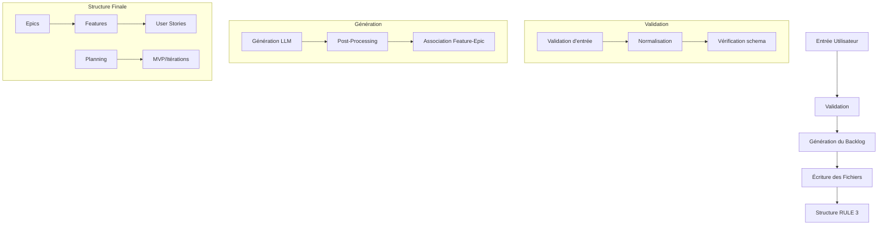

# Documentation d'Architecture - Agile Planner

Cette section contient la documentation technique sur l'architecture du projet Agile Planner MCP Server.

**Date de dernière modification:** 12/05/2025  
**Version:** 1.7.1

## Contenu

### Architecture générale
- [Architecture Macro et Détaillée](architecture.md) - Flux et interactions des composants clés
- [Architecture du serveur MCP](mcp-server-architecture.md) - Architecture complète du serveur MCP

### Composants spécifiques
- [Génération Markdown](markdown-generation.md) - Architecture du système de génération markdown
- [Format du backlog](backlog-format.md) - Structure réelle générée (epics/features/user-stories/orphan-stories)

### Design et compatibilité
- [Design général](design.md) - Patterns et architecture réelle
- [Compatibilité Multi-LLM](multi-llm-compatibility.md) - Adaptations pour Windsurf, Claude, Cursor
- [Diagramme de validation](backlog-validation-diagram.md) - Flux de validation actuel

## Diagramme de l'Architecture

## Responsabilités des Composants

- **Validation** : Assure que les entrées sont conformes aux attentes avant génération
- **Génération du Backlog** : Communication avec les LLMs et structuration des résultats
- **Écriture des Fichiers** : Organisation des fichiers selon RULE 3 et gestion des chemins
- **Association Feature-Epic** : Intelligence pour associer features et epics
