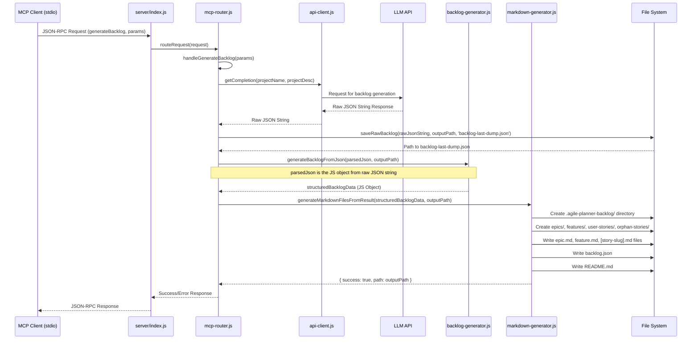
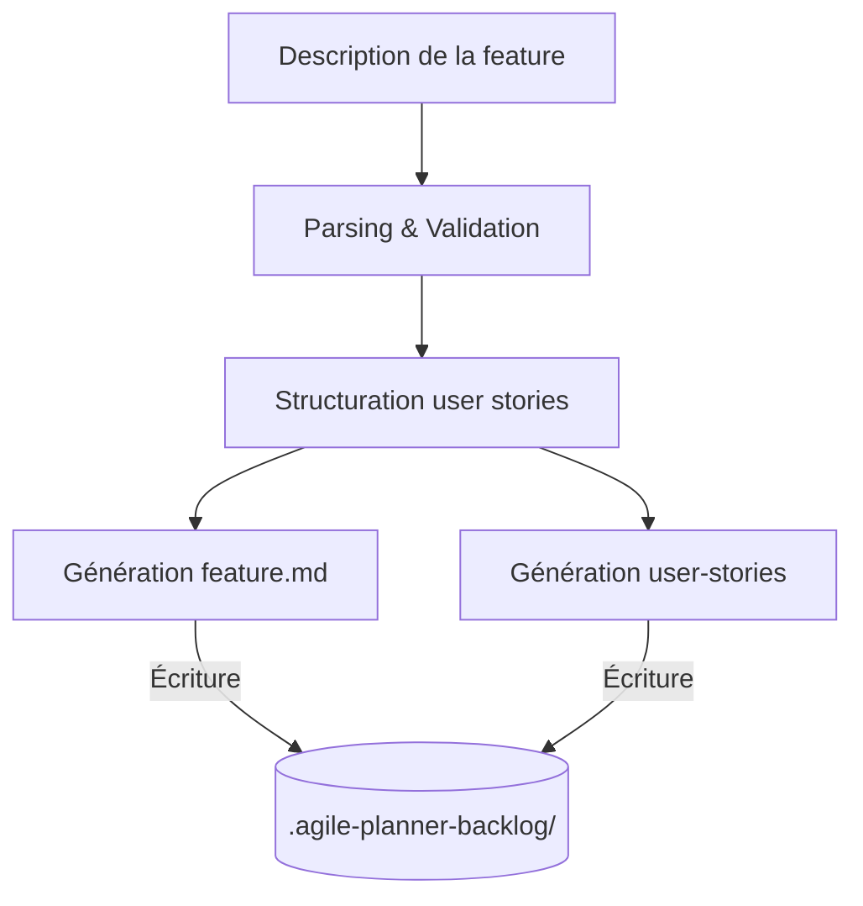
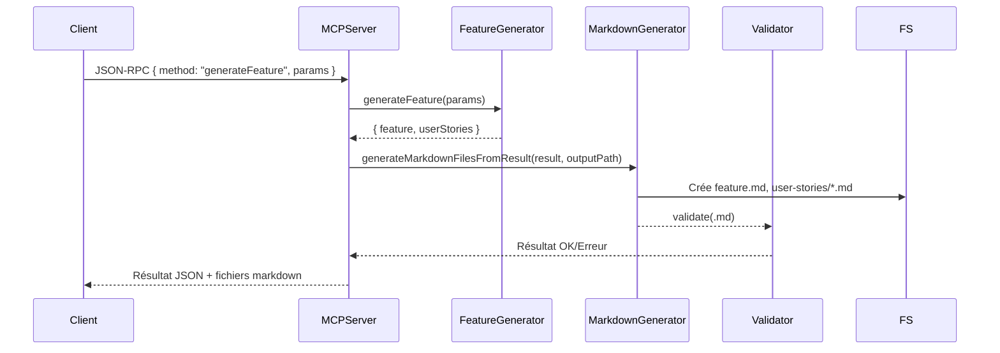
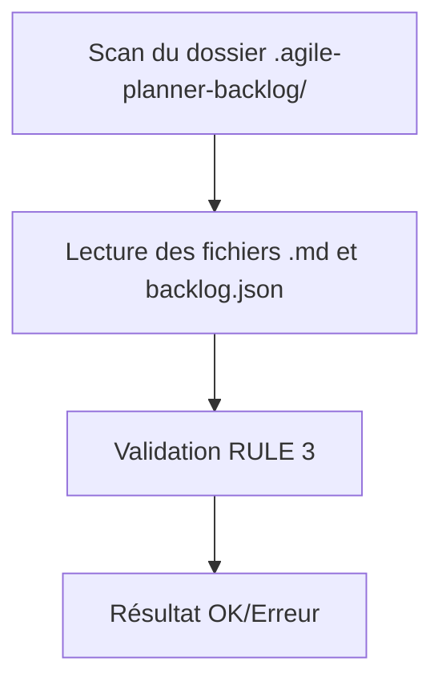
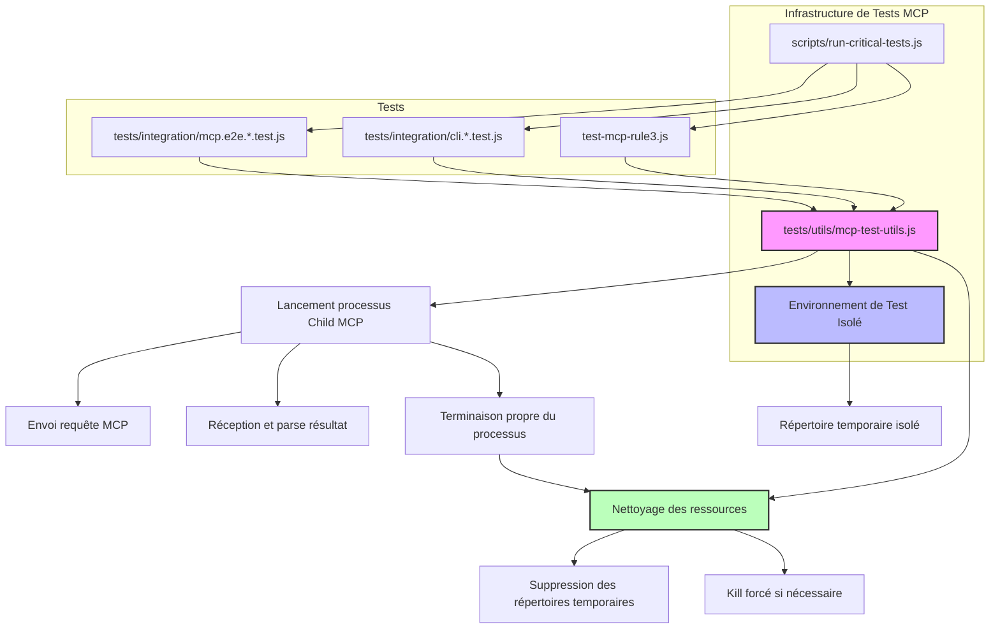

# Architecture Macro - Agile Planner MCP Server v1.7.3

```mermaid
flowchart TD
    subgraph UserInput["User Input"]
        direction LR
        CLI_Input[CLI Command: node server/index.js generateBacklog/Feature ...]
        MCP_Stdio_Input[MCP Client via Stdio: JSON-RPC Request]
    end

    subgraph ServerCore["Agile Planner MCP Server"]
        direction TB
        EntryPoint[server/index.js]
        Router[mcp-router.js]
        ApiClient[api-client.js]
        BacklogGen[backlog-generator.js]
        FeatureGen[feature-generator.js]
        MarkdownGen[markdown-generator.js]
        Rule3Structure[createRule3Structure]
    end

    subgraph FileSystemOutput["File System Output (.agile-planner-backlog/)"]
        direction LR
        BacklogJSON[backlog.json]
        BacklogDumpJSON[backlog-last-dump.json]
        ReadmeMD[README.md]
        EpicsDir[epics/]
        FeaturesDir["features/ &#40;under epics&#41;"]
        UserStoriesDir["user-stories/ &#40;under features&#41;"]
        OrphanStoriesDir[orphan-stories/]
    end

    CLI_Input --> EntryPoint
    MCP_Stdio_Input --> EntryPoint

    EntryPoint -- args --> CLI_Input_Handler{Is CLI mode?}
    EntryPoint -- stdio data --> Router

    CLI_Input_Handler -- Yes --> ApiClient
    Router -- process request --> RequestRouter{Request Type?}
    RequestRouter -- generateBacklog --> HandleGenerateBacklog[handleGenerateBacklog()]
    RequestRouter -- generateFeature --> HandleGenerateFeature[handleGenerateFeature()]
    
    HandleGenerateBacklog --> ApiClient
    HandleGenerateFeature --> ApiClient
    ApiClient --> LLM[LLM API Call]
    LLM --> ApiClient
    ApiClient -- backlog request --> BacklogGen
    ApiClient -- feature request --> FeatureGen

    BacklogGen -- raw backlog data --> HandleGenerateBacklog
    FeatureGen -- raw feature data --> HandleGenerateFeature
    
    HandleGenerateBacklog -- raw backlog data --> MarkdownGen
    HandleGenerateFeature -- raw feature data --> MarkdownGen
    
    HandleGenerateBacklog -- writes --> BacklogDumpJSON
    MarkdownGen -- RULE 3 structure --> Rule3Structure
    Rule3Structure -- writes --> EpicsDir
    Rule3Structure -- writes --> FeaturesDir
    Rule3Structure -- writes --> UserStoriesDir
    Rule3Structure -- writes --> OrphanStoriesDir
    
    BacklogGen -- processed data --> MarkdownGen
    MarkdownGen -- generates files --> BacklogJSON
    MarkdownGen -- generates files --> ReadmeMD
    MarkdownGen -- generates structure & files --> EpicsDir
    EpicsDir --> FeaturesDir
    FeaturesDir --> UserStoriesDir
    MarkdownGen -- generates structure & files --> OrphanStoriesDir
```

## Légende (Macro Architecture)
- **User Input**: Represents the different ways a user can trigger backlog generation.
  - **CLI Command**: Direct command line execution.
  - **MCP Client via Stdio**: Interaction through a compatible MCP client using standard input/output for JSON-RPC.
- **Server Core**: Main components of the Agile Planner server involved in the process.
  - **EntryPoint (`server/index.js`)**: Initial script that receives requests and routes them based on mode (CLI or MCP).
  - **Router (`mcp-router.js`)**: Handles MCP requests, including `generateBacklog` via `handleGenerateBacklog()`.
  - **ApiClient (`api-client.js`)**: Manages communication with the Large Language Model (LLM).
  - **BacklogGen (`backlog-generator.js`)**: Core logic for interpreting LLM output and structuring the raw backlog data.
  - **MarkdownGen (`markdown-generator.js`)**: Generates all markdown files and the `backlog.json` from the structured data.
- **File System Output**: The files and directory structure created in `.agile-planner-backlog/`.
  - **`backlog.json`**: The structured backlog in JSON format (generated by `markdown-generator.js` after processing).
  - **`backlog-last-dump.json`**: The raw JSON output from the LLM, saved by `mcp-router.js` or `cli.js` for audit/debugging.
  - **`README.md`**: A summary README file for the generated backlog.
  - **`epics/`, `features/`, `user-stories/`, `orphan-stories/`**: Directories and markdown files as per RULE 3.
- **LLM**: The external Large Language Model providing the initial backlog content.

---

# Architecture détaillée

## Processus `generateBacklog` (via MCP/stdio)

### Flowchart: `generateBacklog` MCP/stdio
```mermaid
flowchart TD
    A[MCP Client sends JSON-RPC request via Stdio: {method: "generateBacklog", params: {...}}] --> B(server/index.js)
    B -- Detects MCP mode --> C(mcp-router.js)
    C -- Invokes --> D(handleGenerateBacklog)
    D -- Project Name, Description --> E(api-client.js: getCompletion)
    E -- Forms prompt & calls LLM --> LLM((LLM API))
    LLM -- Raw LLM Response (JSON string) --> E
    E -- Raw JSON string --> D
    D -- Saves raw LLM output --> F[/audit/backlog-last-dump.json]
    D -- Parses JSON string to object --> G{Raw Backlog Object}
    G -- Raw Backlog Object & output path --> H(backlog-generator.js: generateBacklogFromJson)
    H -- Processes & structures data (epics, features, stories) --> I{Structured Backlog Object}
    I -- Structured Backlog & output path --> J(markdown-generator.js: generateMarkdownFilesFromResult)
    J -- Creates directory structure --> K[FS: .agile-planner-backlog/epics, features, user-stories, orphan-stories]
    J -- Generates individual .md files --> L[FS: epic.md, feature.md, story.md for each item]
    J -- Generates consolidated backlog --> M[FS: .agile-planner-backlog/backlog.json]
    J -- Generates summary --> N[FS: .agile-planner-backlog/README.md]
    D -- Returns success/error to MCP client --> O(MCP Client receives response)

    style F fill:#lightgrey,stroke:#333,stroke-width:2px
    style K fill:#lightgrey,stroke:#333,stroke-width:2px
    style L fill:#lightgrey,stroke:#333,stroke-width:2px
    style M fill:#lightgrey,stroke:#333,stroke-width:2px
    style N fill:#lightgrey,stroke:#333,stroke-width:2px
```

### Diagramme de Séquence: `handleGenerateBacklog` Interactions


## Générateur de Feature


### Séquence complète generateFeature


## Validateur de Structure


## Architecture des Tests MCP

Version 1.7.1 a introduit une infrastructure de test optimisée pour améliorer la fiabilité des tests MCP et éviter les fuites de ressources.



### Modules Clés de Test

- **mcp-test-utils.js**: Utilitaires spécialisés pour l'exécution des tests MCP avec une gestion optimisée des processus et des ressources.
  - `runMcpCommand`: Exécute une commande MCP dans un processus enfant et renvoie une promesse qui se résout avec le résultat.
  - `setupMcpTestEnvironment`: Crée un environnement de test isolé avec nettoyage automatique.
  - `terminateProcess`: Assure la terminaison propre d'un processus, avec kill forcé en dernier recours.
  
- **run-critical-tests.js**: Script exécutant les tests critiques avec différents modes de tolérance aux erreurs.
  - Mode normal: Exécute tous les tests avec rapports d'échecs.
  - Mode rapide (--quick): Ignore les tests alternatifs et produit toujours un exit code 0.
  - Mode strict (--strict): Exit code non-zéro pour tout échec.

---

Dernière mise à jour : 2025-05-13
