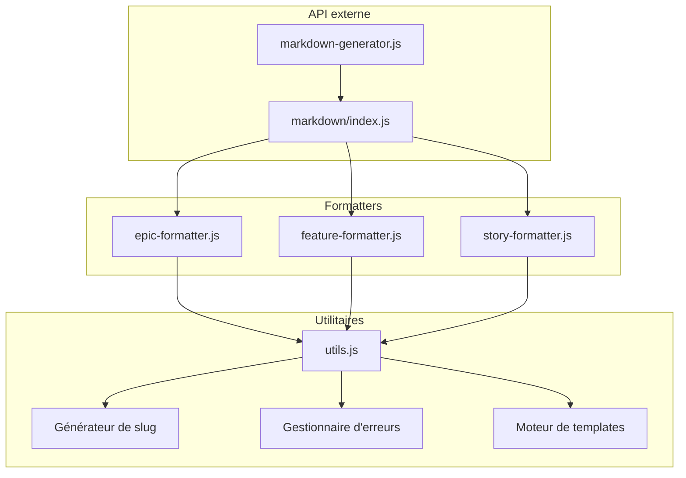
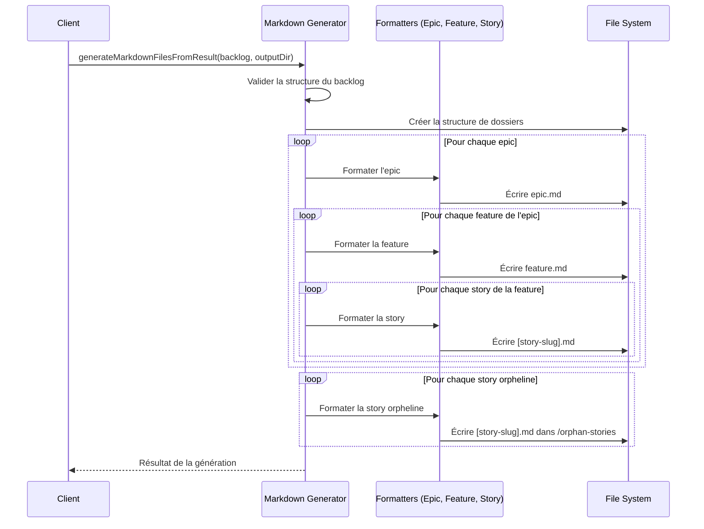
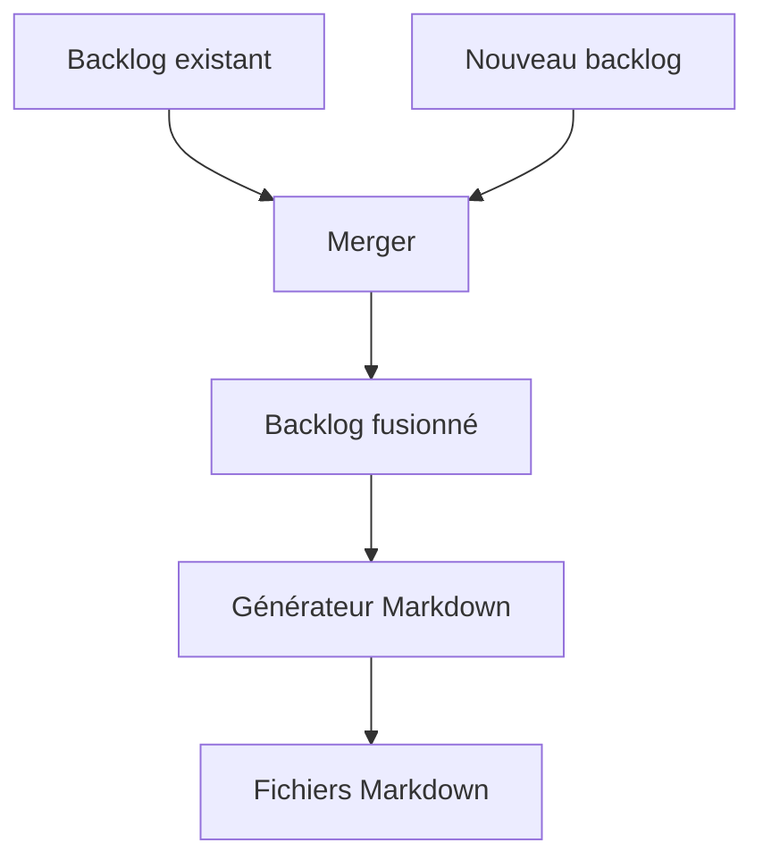
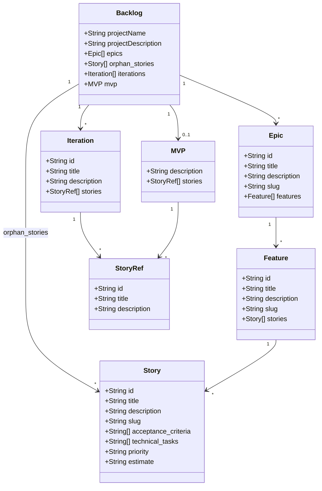

# Système de génération Markdown

**Date de dernière modification:** 12/05/2025  
**Version:** 1.7.1

## Introduction

Le système de génération markdown d'Agile Planner transforme les structures de backlog en fichiers markdown organisés selon une hiérarchie claire. Ce document détaille l'architecture, les composants et le fonctionnement du système.

## Architecture modulaire

Le générateur markdown a été conçu selon une architecture modulaire pour maximiser la maintenabilité et permettre les évolutions futures.



## Flux de génération

### 1. Processus général



### 2. Étapes détaillées

1. **Validation du backlog** - Vérifie que le backlog est bien formé
2. **Création de la structure** - Crée les dossiers nécessaires
3. **Génération des epics** - Génère les fichiers markdown pour chaque epic
4. **Génération des features** - Génère les fichiers markdown pour chaque feature
5. **Génération des stories** - Génère les fichiers markdown pour chaque story
6. **Traitement des orphelins** - Gère les stories qui ne sont pas associées à une feature

## Composants du système

### 1. Module façade (`markdown-generator.js`)

Ce module assure la compatibilité avec les versions précédentes et sert de point d'entrée unique pour le système de génération markdown.

```javascript
// Exemple simplifié d'utilisation
const { generateMarkdownFiles } = require('./lib/markdown-generator');

await generateMarkdownFiles(backlogData, outputDir);
```

### 2. Générateur principal (`markdown/index.js`)

C'est le cœur du système qui orchestre tout le processus de génération.

```javascript
// Utilisation du générateur principal
const { createMarkdownGenerator } = require('./lib/markdown/index');
const generator = createMarkdownGenerator();
await generator.generateMarkdownFilesFromResult(backlog, outputDir);
```

### 3. Formateurs spécialisés

Chaque type d'élément (epic, feature, story) possède son propre formateur qui définit comment transformer les données en markdown.

| Formateur | Fichier | Responsabilité |
|-----------|---------|----------------|
| Epic Formatter | `epic-formatter.js` | Génère les fichiers epic.md |
| Feature Formatter | `feature-formatter.js` | Génère les fichiers feature.md |
| Story Formatter | `story-formatter.js` | Génère les fichiers [story-slug].md |

### 4. Utilitaires communs

```javascript
// Exemple de génération de slug
const { createSlug } = require('./utils');
const slug = createSlug('Mon titre avec des espaces'); // -> 'mon-titre-avec-des-espaces'
```

## Structure de fichiers générée

```
.agile-planner-backlog/
├── backlog.json
├── epics/
│   └── [epic-slug]/
│       ├── epic.md
│       └── features/
│           └── [feature-slug]/
│               ├── feature.md
│               └── user-stories/
│                   └── [story-slug].md
└── orphan-stories/
    └── [story-slug].md
```

## Mécanismes de fusion

Le système permet la fusion de backlogs existants avec de nouveaux backlogs, ce qui est particulièrement utile lors des itérations successives.



### Stratégies de fusion

| Élément | Stratégie de fusion |
|---------|---------------------|
| Project Info | Fusion des métadonnées du projet |
| Epics | Fusion par ID ou par titre si ID absent |
| Features | Fusion par ID ou par titre si ID absent |
| Stories | Fusion par ID ou par titre si ID absent |
| Iterations | Ajout de nouvelles itérations, mise à jour des existantes |
| MVP | Mise à jour des informations de MVP |

## Personnalisation des templates

Les templates de génération peuvent être personnalisés en modifiant les constantes définies dans les formateurs respectifs:

```javascript
const epicFileInstructions = `Ce document est généré par Agile Planner et contient des informations sur un Epic.
Les User Stories associées se trouvent dans les sous-dossiers.
Vous pouvez explorer le backlog complet en naviguant dans les liens.`;
```

## Modèle de données



## Bonnes pratiques

1. **Unicité des identifiants** - Toujours s'assurer que les éléments ont des IDs uniques
2. **Validation des slugs** - Vérifier que les slugs sont valides pour éviter les problèmes de chemins
3. **Gestion des erreurs** - Capturer et logger les erreurs pour faciliter le débogage
4. **Éviter les boucles infinies** - Limiter la profondeur de récursion dans les structures imbriquées

## Références

- [Format du backlog](./backlog-format.md)
- [Architecture MCP](./mcp-server-architecture.md)
- [GitHub Flavored Markdown](https://github.github.com/gfm/)
