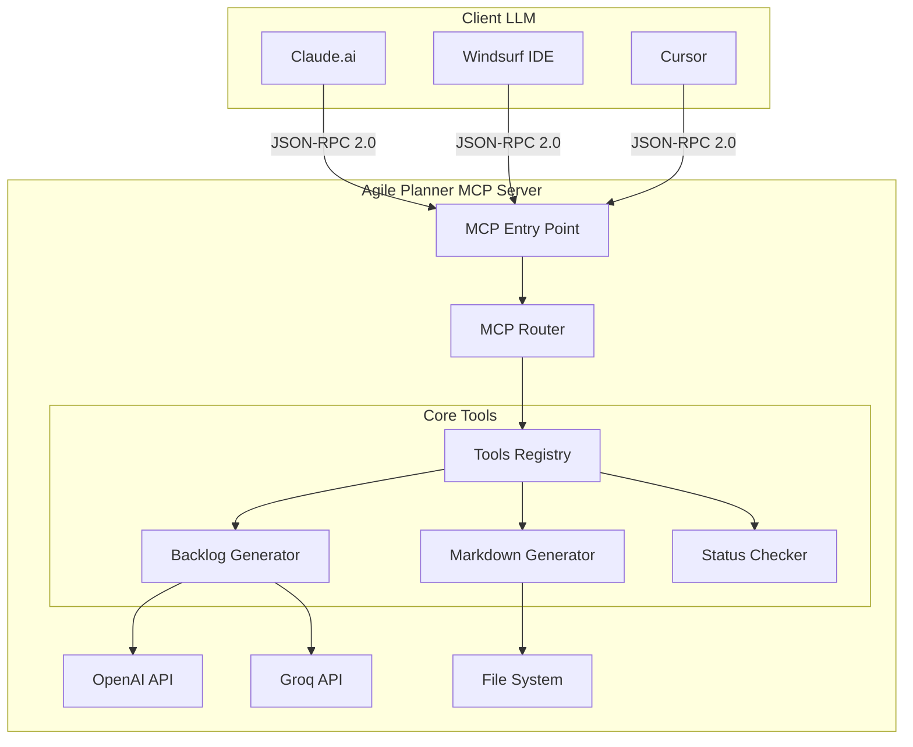
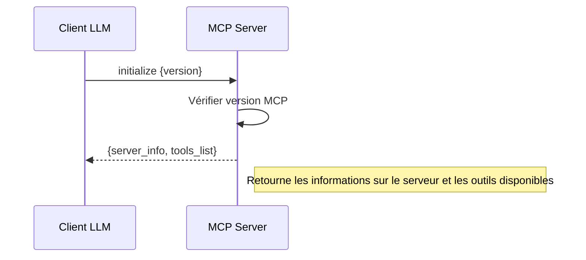
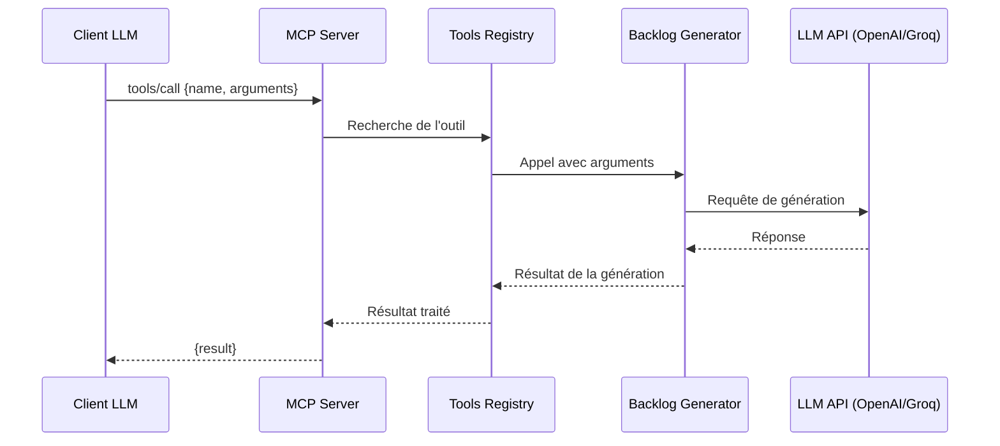
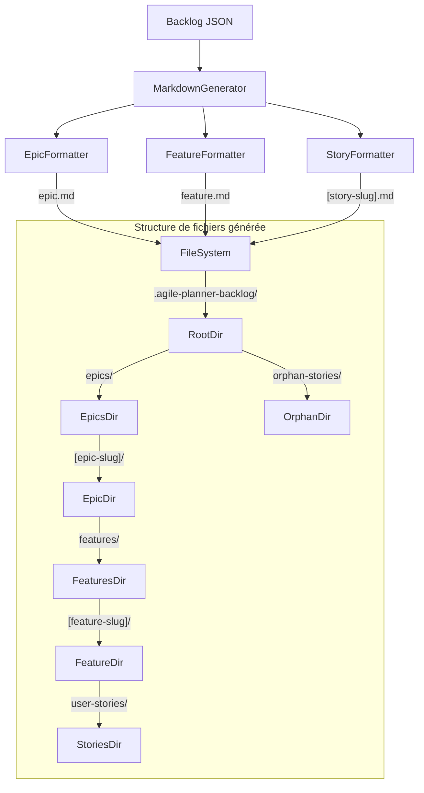
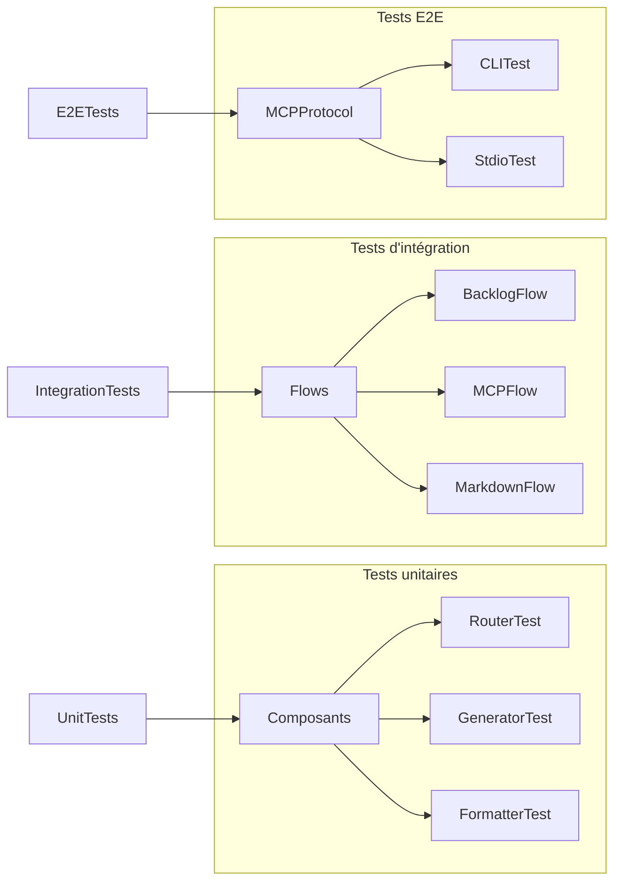

# Architecture du serveur MCP Agile Planner

**Date de dernière modification:** 12/05/2025  
**Version:** 1.7.1

## Vue d'ensemble

Agile Planner implémente le protocole MCP (Model Context Protocol) qui permet aux assistants IA comme Claude, Cursor et Windsurf IDE d'interagir avec des outils externes. Cette documentation détaille l'architecture et le fonctionnement du serveur MCP.

## Architecture générale



## Fonctionnement du serveur MCP

Le serveur MCP Agile Planner utilise le protocole JSON-RPC 2.0 pour communiquer avec les clients LLM. Le flux général est le suivant:

### 1. Initialisation



### 2. Appel d'outil



## Composants principaux

### MCP Router (`server/lib/mcp-router.js`)

Le routeur MCP est responsable de:
- Recevoir et valider les requêtes JSON-RPC 2.0
- Dispatcher les requêtes vers les handlers appropriés
- Formater les réponses selon la spécification MCP

```javascript
// Exemple simplifié du fonctionnement du routeur MCP
function processRequest(jsonRequest) {
  if (jsonRequest.method === 'initialize') {
    return handleInitialize(jsonRequest);
  } else if (jsonRequest.method === 'tools/list') {
    return handleToolsList(jsonRequest);
  } else if (jsonRequest.method === 'tools/call') {
    return handleToolsCall(jsonRequest);
  } else {
    return createErrorResponse(jsonRequest.id, 'Method not found');
  }
}
```

### Registre d'outils

Les outils disponibles dans Agile Planner MCP incluent:

| Nom | Description | Arguments | Retour |
|-----|-------------|-----------|--------|
| `generateBacklog` | Génère un backlog complet | `projectName`, `projectDescription`, `outputPath` | Structure JSON du backlog |
| `generateFeature` | Génère une feature isolée | `featureTitle`, `featureDescription`, `outputPath` | Structure JSON de la feature |
| `getStatus` | Vérifie le statut du serveur | - | État actuel du serveur |

### Générateur de backlog

Le générateur de backlog est responsable de:
- Construire les prompts pour le LLM (OpenAI/Groq)
- Envoyer les requêtes à l'API appropriée
- Traiter et valider les réponses
- Générer les fichiers markdown correspondants

## Architecture de génération markdown



## Modes de fonctionnement

Agile Planner peut fonctionner dans trois modes distincts:

1. **Mode MCP** - Communication via stdio pour intégration avec les LLM
2. **Mode CLI** - Interface en ligne de commande pour utilisation directe
3. **Mode API** - Serveur HTTP pour intégrations personnalisées

Tous les modes partagent le même cœur fonctionnel pour assurer la cohérence.

## Tests et validation

Le système de tests inclut:

- Tests unitaires pour chaque composant
- Tests d'intégration pour le flux complet
- Tests end-to-end spécifiques au protocole MCP



## Sécurité et gestion des erreurs

Le serveur MCP inclut plusieurs mécanismes de sécurité:

- Validation des entrées utilisateur
- Gestion des timeouts pour les requêtes LLM
- Logs détaillés pour le débogage
- Mécanismes de reprise sur erreur

## Références

- [Spécification MCP](https://github.com/anthropics/anthropic-cookbook/tree/main/mcp)
- [Documentation JSON-RPC 2.0](https://www.jsonrpc.org/specification)
- [Formats de backlog](./backlog-format.md)
