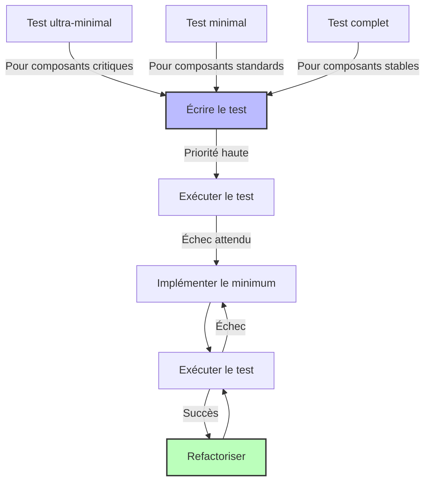

# Documentation Développeur - Agile Planner

Cette section contient la documentation technique destinée aux développeurs travaillant sur le projet Agile Planner MCP Server.

## Guides de Développement

- [Guide de tests](testing-guide.md) - Guide complet sur les tests unitaires et d'intégration
- [Roadmap de tests](test-roadmap.md) - Plan de progression des tests TDD Wave 8
- [Stratégie de résolution de tests](test-resolution-strategy.md) - Méthodologie pour résoudre les problèmes de tests

## Plans de Refactorisation

- [Plan de refactorisation](refactor-plan.md) - Plan global de refactorisation du projet
- [Tâches de refactorisation](refactor-tasks.md) - Liste des tâches spécifiques de refactorisation
- [Plan de refactorisation des tests](test-refactoring-plan.md) - Plan dédié à la refactorisation des tests

## Gestion de Projet

- [Tâches à faire](todo-tasks.md) - Liste des tâches prioritaires à accomplir
- [Fichiers obsolètes](obsolete-files.md) - Inventaire des fichiers à supprimer ou migrer

## Processus TDD Wave 8

## Structure des Tests

- **Tests ultra-minimaux** : Tests isolés avec mocks pour les dépendances
- **Tests minimaux** : Tests simples couvrant un seul aspect d'un composant
- **Tests complets** : Tests exhaustifs pour les composants stables

## Conventions de Code

- Limiter les fichiers à 500 lignes maximum (hors tests et configuration)
- Limiter les fonctions à 50 lignes maximum
- Appliquer les principes SOLID dans la conception
- Documenter tous les patterns implémentés dans le code
