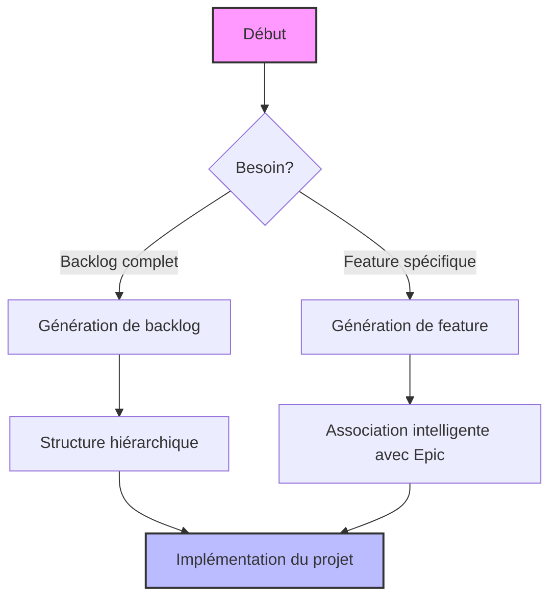

# Guides Utilisateur - Agile Planner

Cette section contient les guides et documentation destinés aux utilisateurs du projet Agile Planner MCP Server.

**Date de dernière modification:** 12/05/2025  
**Version:** 1.7.1

## Guides Disponibles

### Guides d'intégration
- [Guide d'intégration MCP](mcp-integration.md) - Instructions pour intégrer Agile Planner avec Claude, Cursor et Windsurf IDE

### Guides d'utilisation
- [Guide d'utilisation optimal](optimal-usage-guide.md) - Guide détaillé sur la façon d'utiliser efficacement Agile Planner
- [Guide de migration](migration-guide.md) - Instructions pour migrer depuis les versions précédentes
- [README en français](readme-fr.md) - Documentation complète en français

## Cas d'Usage Courants

## Premiers Pas

1. **Configurer l'environnement**
   - Ajouter votre clé API (OpenAI ou GROQ)
   - Configurer le serveur MCP dans votre environnement Windsurf/Cascade/Cursor

2. **Générer votre premier backlog**
   - Fournir une description claire du projet
   - Examiner la structure générée dans `.agile-planner-backlog/`

3. **Ajouter des features spécifiques**
   - Utiliser la commande `generateFeature` pour ajouter de nouvelles fonctionnalités
   - Vérifier leur association avec les epics appropriées

## Bonnes Pratiques

- Fournir des descriptions détaillées pour des résultats plus précis
- Examiner les user stories générées et ajuster si nécessaire
- Utiliser la structure pour guider le développement avec votre assistant IA
